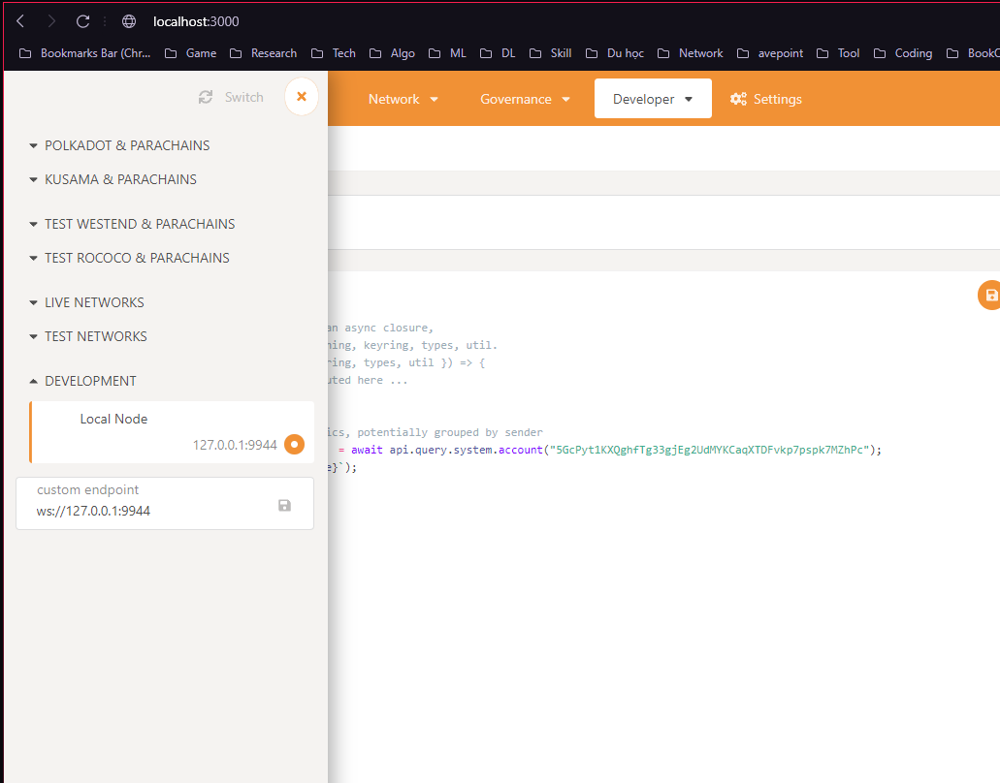

## How to run ?

### Create local Polkadot chain:

```sh
docker run -p 9944:9944 parity/polkadot:v0.8.24 --name "Local" --rpc-external --ws-external --alice --dev
```

### Run Polkadot-app to check and test:

```sh
git clone https://github.com/polkadot-js/apps polkadot-js
cd polkadot-js
yarn
yarn run start
```

Then switch to local node:


### Run wallet:

```sh
npm start
```
